# MEAN Stack CRUD Application with CI/CD Pipeline

A full-stack CRUD application built using the MEAN stack (MongoDB, Express, Angular 15, Node.js) with automated CI/CD pipeline using Jenkins and Docker.

## Live Demo

- **Application URL:** http://56.155.134.233:80
- **Jenkins Dashboard:** http://56.155.134.233:8080

## Project Overview

This application manages a collection of tutorials where each tutorial includes:
- ID
- Title  
- Description
- Published status

Users can create, retrieve, update, and delete tutorials. A search feature allows finding tutorials by title.

## Tech Stack

| Component | Technology |
|-----------|------------|
| Frontend | Angular 15 |
| Backend | Node.js, Express.js |
| Database | MongoDB |
| Containerization | Docker |
| CI/CD | Jenkins |
| Reverse Proxy | Nginx |
| Cloud Platform | AWS EC2 |

## Project Structure

```
├── backend/
│   ├── Dockerfile
│   ├── server.js
│   ├── package.json
│   └── app/
│       ├── config/
│       │   └── db.config.js
│       ├── controllers/
│       │   └── tutorial.controller.js
│       ├── models/
│       │   └── tutorial.model.js
│       └── routes/
│           └── turorial.routes.js
├── frontend/
│   ├── Dockerfile
│   ├── nginx.conf
│   ├── package.json
│   └── src/
│       └── app/
│           ├── components/
│           ├── models/
│           └── services/
├── docker-compose.yml
├── Jenkinsfile
└── README.md
```

## Local Development Setup

### Prerequisites
- Node.js 18+
- MongoDB
- Angular CLI
- Docker & Docker Compose (optional)

### Backend Setup

```bash
cd backend
npm install
node server.js
```

Backend runs on `http://localhost:8080`

### Frontend Setup

```bash
cd frontend
npm install
npx ng serve --port 8081
```

Frontend runs on `http://localhost:8081`

### Using Docker Compose (Recommended)

```bash
docker compose up -d --build
```

Application will be available at `http://localhost:80`

## API Endpoints

| Method | Endpoint | Description |
|--------|----------|-------------|
| GET | /api/tutorials | Get all tutorials |
| GET | /api/tutorials/:id | Get tutorial by ID |
| GET | /api/tutorials?title= | Search tutorials by title |
| GET | /api/tutorials/published | Get published tutorials |
| POST | /api/tutorials | Create new tutorial |
| PUT | /api/tutorials/:id | Update tutorial |
| DELETE | /api/tutorials/:id | Delete tutorial |
| DELETE | /api/tutorials | Delete all tutorials |

## Docker Configuration

### Backend Dockerfile
- Multi-stage build using Node.js 18 Alpine
- Runs as non-root user for security
- Exposes port 8080

### Frontend Dockerfile  
- Multi-stage build: Node.js for building, Nginx for serving
- Nginx configured as reverse proxy to backend
- Exposes port 80

### Docker Compose Services
- **mongodb** - MongoDB 6.0 database with persistent volume
- **backend** - Node.js API server (port 3000:8080)
- **frontend** - Angular app with Nginx (port 80:80)

## CI/CD Pipeline

The Jenkins pipeline automates the entire build and deployment process.

### Pipeline Stages

1. **Checkout** - Clone repository from GitHub
2. **Build Backend Image** - Build Docker image for backend
3. **Build Frontend Image** - Build Docker image for frontend
4. **Login to DockerHub** - Authenticate with Docker Hub
5. **Push Images** - Push images to Docker Hub registry
6. **Deploy** - Deploy containers using Docker Compose

### Jenkins Configuration

1. Create credentials with ID `dockerhub-creds` (Username/Password)
2. Create Pipeline job pointing to GitHub repository
3. Configure GitHub webhook for automatic builds

### GitHub Webhook

Webhook URL: `http://<jenkins-server>:8080/github-webhook/`

Triggers pipeline automatically on every push to main branch.

## Deployment Architecture

```
                    ┌─────────────────┐
                    │   GitHub Repo   │
                    └────────┬────────┘
                             │ webhook
                             ▼
                    ┌─────────────────┐
                    │    Jenkins      │
                    │   (Port 8080)   │
                    └────────┬────────┘
                             │ build & deploy
                             ▼
         ┌───────────────────────────────────────┐
         │           Docker Compose              │
         │  ┌─────────┐ ┌─────────┐ ┌─────────┐  │
         │  │ MongoDB │ │ Backend │ │Frontend │  │
         │  │  :27017 │ │  :8080  │ │  :80    │  │
         │  └─────────┘ └─────────┘ └────┬────┘  │
         └───────────────────────────────┼───────┘
                                         │
                                         ▼
                              ┌─────────────────┐
                              │   Users Access  │
                              │   Port 80       │
                              └─────────────────┘
```

## Screenshots

### 1. AWS EC2 Instance Setup
Creating Ubuntu EC2 instance on AWS
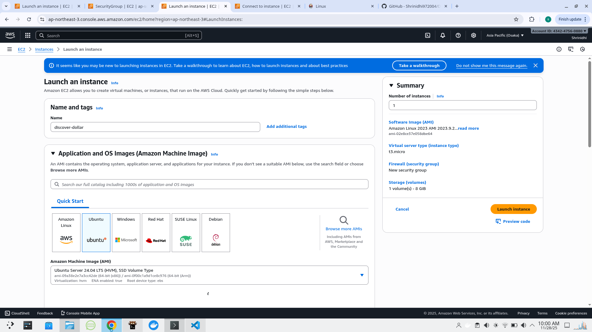

### 2. Jenkins Installation
Jenkins installed and running on the server
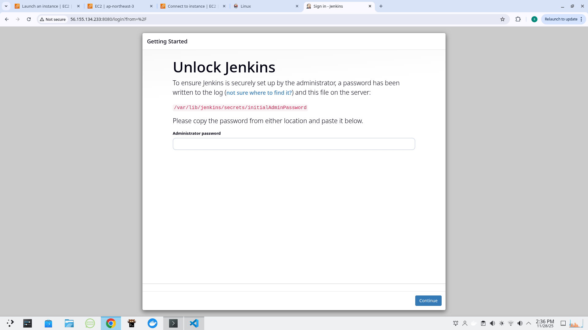

### 3. Jenkins Dashboard
Jenkins dashboard after initial setup
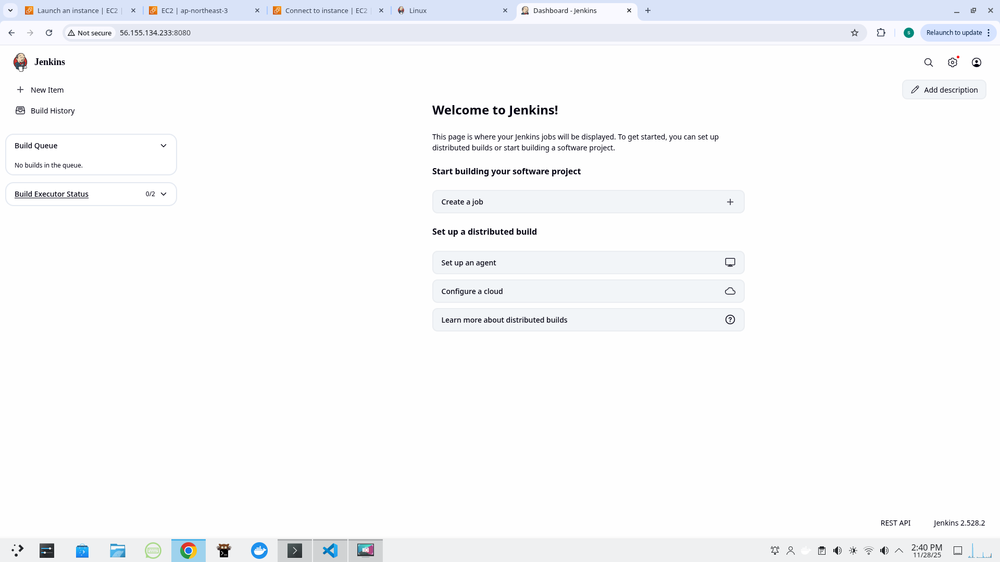

### 4. Installing Plugins
Installing necessary Jenkins plugins
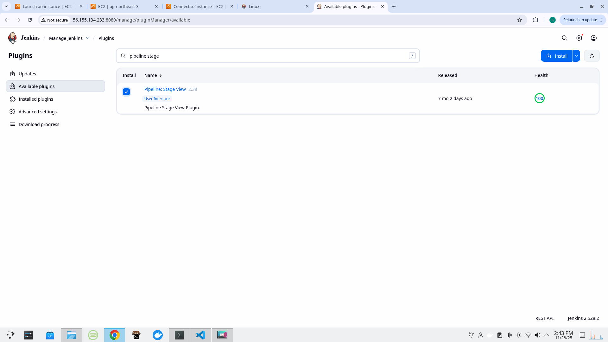

### 5. Creating CI/CD Pipeline
Setting up new pipeline job in Jenkins
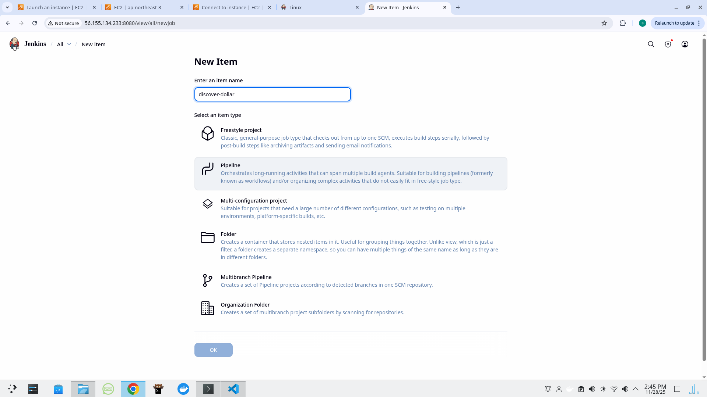

### 6. DockerHub Credentials
Adding DockerHub credentials to Jenkins
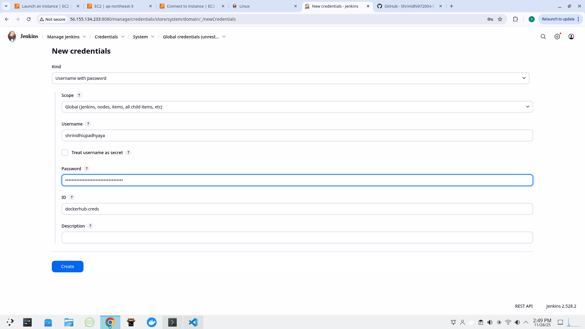

### 7. First Successful Build
CI/CD pipeline completed successfully
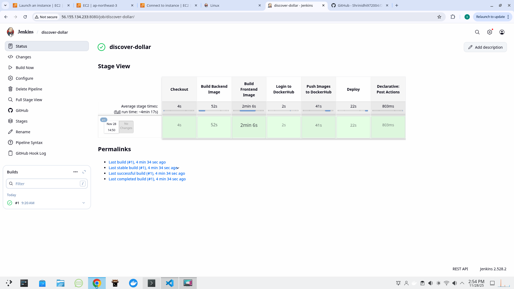

### 8. Application Accessible
Application running on http://56.155.134.233:80
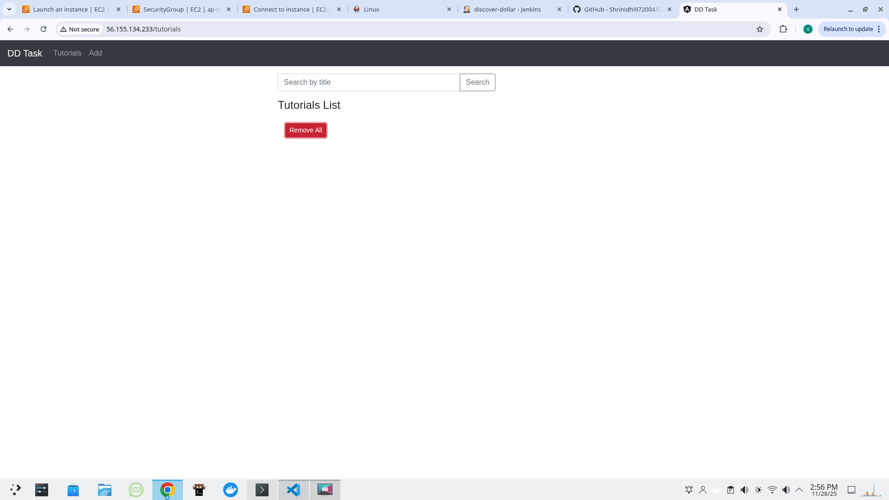

### 9. Application Screenshots
Tutorial management interface
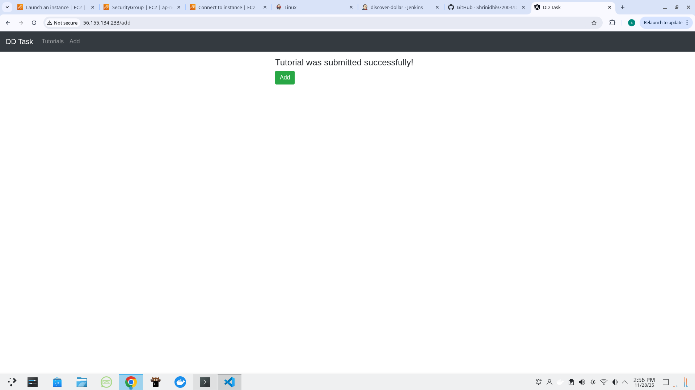
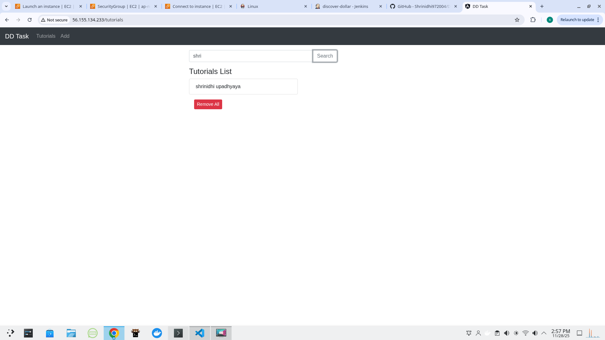

### 10. GitHub Webhook Configuration
Setting up webhook for automatic builds
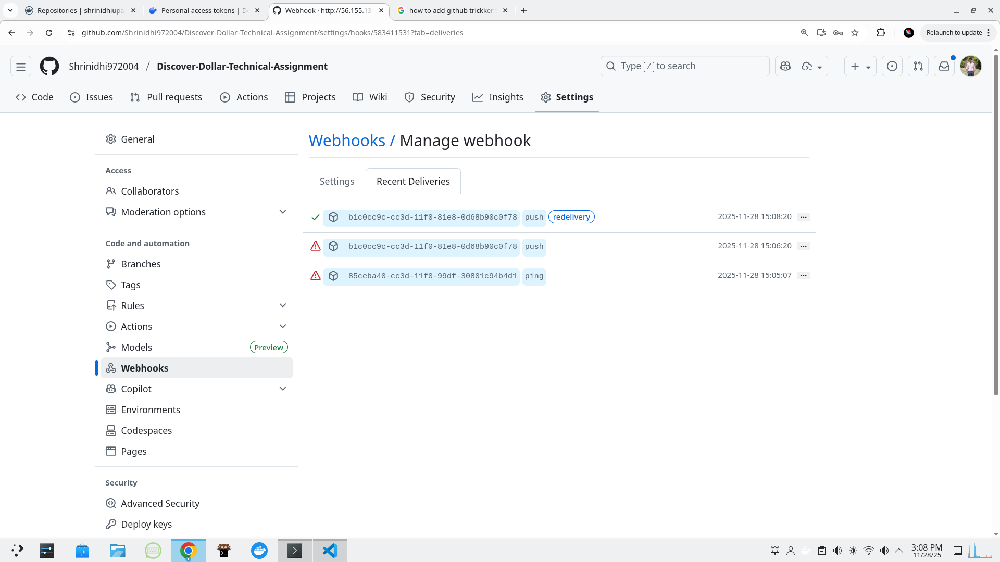

### 11. Application Interface
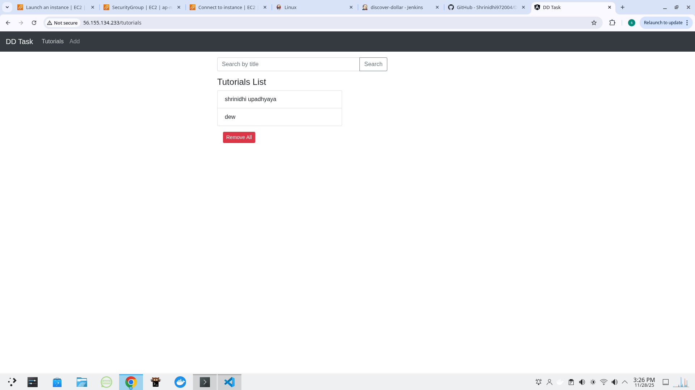

### 12. Final CI/CD Build
Final successful pipeline execution
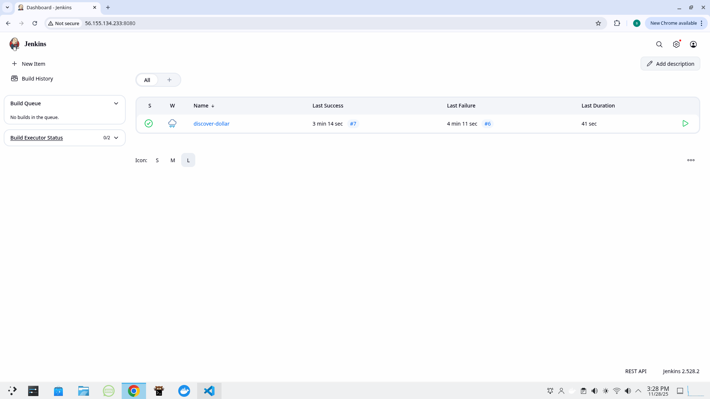

## Environment Variables

| Variable | Description | Default |
|----------|-------------|---------|
| MONGO_URI | MongoDB connection string | mongodb://mongodb:27017/dd_db |
| PORT | Backend server port | 8080 |

## Troubleshooting

### Docker Permission Denied
```bash
sudo usermod -aG docker jenkins
sudo systemctl restart jenkins
```

### Port Already in Use
```bash
sudo fuser -k 80/tcp
docker compose down
docker compose up -d
```

## Author

**Shrinidhi Upadhyaya**

- GitHub: [@Shrinidhi972004](https://github.com/Shrinidhi972004)
- Docker Hub: [shrinidhiupadhyaya](https://hub.docker.com/u/shrinidhiupadhyaya)

